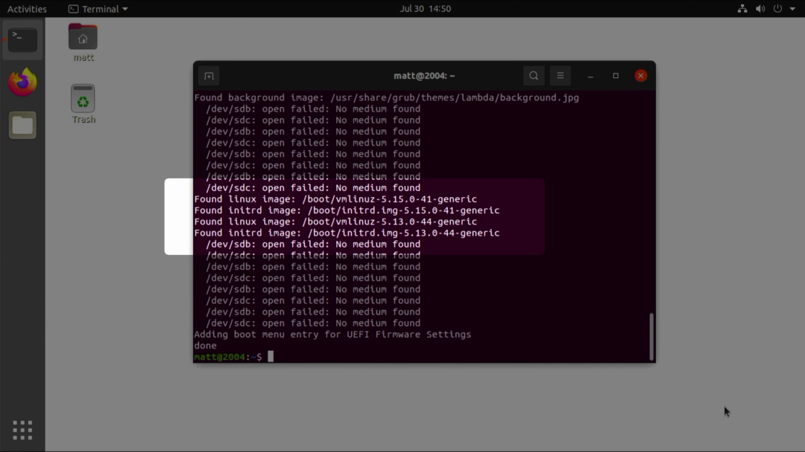

# Dual Boot 20.04 and 18.04 with LUKS
## 1

Format the SATA device and create 5 new partitions:
* Part1 will be the EFI boot partition
* Part2 will be the 20.04 /boot partition
* Part3 will be the 20.04 LUKS partition
* Part4 will be the 18.04 /boot partition
* Part5 will be the 18.04 LUKS partition

 Partition 1 should be 2GB
 The boot partitions should be big enough to hold all of the kernels that will ever be installed 10GB is very safe
 The LUKS partitions should half of the total drive capacity each, less the 2GB used for EFI and the amount used for the boot partitions.

**NOTE--** These will all be formatted later on. **DO NOT** select the encryption options. Use defaults for now

## 2

This guide assumes that the drive is labeled as SDA. This is what the output of `lsblk /dev/sda` should look like

## 3

First we will setup /dev/sda1 for use as the EFI partition

```
mkfs.vfat -F 16 -n EFI-SP /dev/sda1
```

## 4

Now we will build the LUKS contianer for the 20.04 root partition

```
cryptsetup luksFormat /dev/sda3
```

## 5

Now we will decrypt and map /dev/sda3 to sda3_crypt

```
cryptsetup open /dev/sda3 sda3_crypt
```

`ls /dev/mapper` shows that is is mapped

## 6

Format /dev/sda2 as ext4 

```mkfs.ext4 L boot_2004 /dev/sda2
```

## 7

We will use LVM under the LUKS partition. This cleared up the major issues I was having in other testing and all of the documentation pointed to use LVM


```
pvcreate/dev/mapper/sda3_crypt
vgcreate 2004-vg /dev/mapper/sda3_crypt
lvcreate -L 4G -n swap_1 2004 vg
lvcreate -l 80%FREE -n root 2004-vg
```

```
Block diagram of LUKS and LVM
  ┌─────────────────────────────────────┐
  │     LUKS                            │
  │ ┌─────────────────────────────────┐ │
  │ │   PV                            │ │
  │ │ ┌─────────────────────────────┐ │ │
  │ │ │ GV                          │ │ │
  │ │ ├───────┬─────────────────────┤ │ │
  │ │ │ LV    │        LV           │ │ │
  │ │ │       │                     │ │ │
  │ │ │   SWAP│          ROOT       │ │ │
  │ │ │       │                     │ │ │
  │ │ │       │                     │ │ │
  │ │ │       │                     │ │ │
  │ │ │       │                     │ │ │
  │ ├─┼───────┼─────────────────────┼─┤ │
  └─┴─────────────────────────────────┴─┘
```

## 8


## 9 

Launch the Installer and choose 'Something else' as the Installation type

## 10

Select the child /dev/mapper/2004-vg-root and edit the partition as EXT4, format the partition, and set '/' as the mount point

## 11

Select the child /dev/mapper/2004-vg-swap_1 and 'Use as: swap area'

## 12

Select /dev/sda1 and 'Use as: EFI System Partition'

## 13

Select /dev/sda2 and Format as EXT4, format the partition and set mount point as '/boot'

## 14

Select the root device-- /dev/sda as the bootloader installation device

## 15


## 16


## 17

After Installtion is complete, choose Continue Testing

## 18

We need to chroot into the new install so we have to mount the proc sys dev and etc/resolv devices onto the new install before we reboot

```
for n in proc sys dev etc/resolv.conf; do mount --rbind /$n /target/$n; done
chroot /target
mount -av
```
you should see:

```
/
/boot
/boot/efi
```

## 19

Create a crypttab file
sda3_crypt is the mapper lable for sda3, the UUID should be for /dev/sda3 and 'none luks,discard' options are added
This one-liner will set it up correctly, assuming again that the device is /dev/sda

```
echo "sda3_crypt UUID=$(blkid -s UUID -o value /dev/sda3) none luks,discard" > /etc/crypttab
```

## 20 

edit /etc/default/grub to show the grub menu and rebuild grub
I neglected to update-initramfs before I rebooted
**DO NOT REBOOT until you have run `update-initramfs -u -k all`** [shown on slide 24](#24)

## 21

I inclued these and the next several slides to show you how to back out of the mistake I made, I thought it might be helpful
You can see here that /dev/mapper doesn't have my LVM volume group because GRUB did not prompt to decrypt the partition

## 22

From the initramfs busybox environment
`cryptsetup open /dev/sda3 sda3_crypt`
this will map the the expected mapper location and boot can resume

## 23

`exit` to continue boot

## 24

This is what I should have done on slide 20

## 25 

Reboot and you should be prompted to unlock sda3_crypt

## 26

it works

## 27 reboot into the UEFI/BIOS and boot from the 18.04 Rescue ISO


## 28

similar to what we did for 20.04, but this time we will be using /dev/sda4 for /boot and /dev/sda5 for the LUKS partition

```
cryptsetup luksFormat /dev/sda5
```

## 29

open and setup the device mapper to sda5_crypt

```
cryptsetup open /dev/sda5 sda5_crypt
```

## 30

create an ext4 filesystem on /dev/sda4

```
mkfs.ext4 -L boot_1804 /dev/sda4
```
## 31

NOTE-- I messed up the LVM naming convention here. What I did works, but 100% of the documentation uses <<name>>--vg like i did for 20.04. You may want to sub 1804-vg for luks-1804 in the following commands.

```
pvcreate/dev/mapper/sda5_crypt
vgcreate luks-1804 /dev/mapper/sda5_crypt
lvcreate -L 4G -n swap_1 luks-1804
lvcreate -l 80%FREE -n root luks-1804
```

**CORRECTED**

```
vgcreate 1804-vg /dev/mapper/sda5_crypt
lvcreate -L 4G -n swap_1 1804-vg
lvcreate -l 80%FREE -n root 1804-vg
```

## 32

launch unquity without the installing a bootloader 

`uquiquity -b`

## 33

Installation type: Something else

## 34

/dev/mapper/luks--1804-root as EXT4, format, Mount Point "/"

## 35

/dev/mapper/luks--1804-swap_1 as 'swap area'

## 36

Check that /dev/sda is used as EFI System Partion. No change should be needed here

## 37

Edit /dev/sda for EXT4, format and mount to '/boot'

## 38

Install and continue testing upon completion

## 39

18.04 installer does not handle the LVM to /target mount as well as 20.04 so I ran

```
mount /dev/mapper/luks--1804-root /target
```

to mount it /target
then:

```
for n in proc sys dev etc/resolv.conf; do mount --rbind /$n /target/$n; done
chroot /target
mount -av
```

Then, very similar to for 20.04, just shifting from sda3 to sda5, setup /etc/crypttab
```
echo "sda5_crypt UUID=$(blkid -s UUID -o value /dev/sda5) none luks,discard" > /etc/crypttab
```
## 40


```
update-initramfs -u -k all
```
So that the initramfs will know about the crypttab
** We are relying on 20.04 GRUB so you do not need to update GRUB **

## 41

This is the GRUB menu for 20.04-- It doesn't know about 18.04 yet so we have one more cleanup task to perform. Boot into 20.04

## 42


## 43


update-grub is not finding the initrd images for the 5.4 kernel. Rather than forcing it to, we are going to expose the 18.04 install and run again so it sees it as a seperate OS

## 44


```
** NOT SHOWN ON SLIDE ** 
decrypt /dev/sda5 and map to expected label of sda5_crypt
cryptsetup open /dev/sda5 sda5_crypt 
```
Activate root lv:

```
lvchange -ay luks-1804
```

Mount the lv to /mnt:

```
mount /dev/mapper/luks--1804-root /mnt
```

## 45 

Run `update_grub` and it will find 18.04.6 and add a boot menu entry. 

## 46

18.04 shows up now

## 47 

Prompt to unlock sda5_crypt

## 48

booted into 18.04


